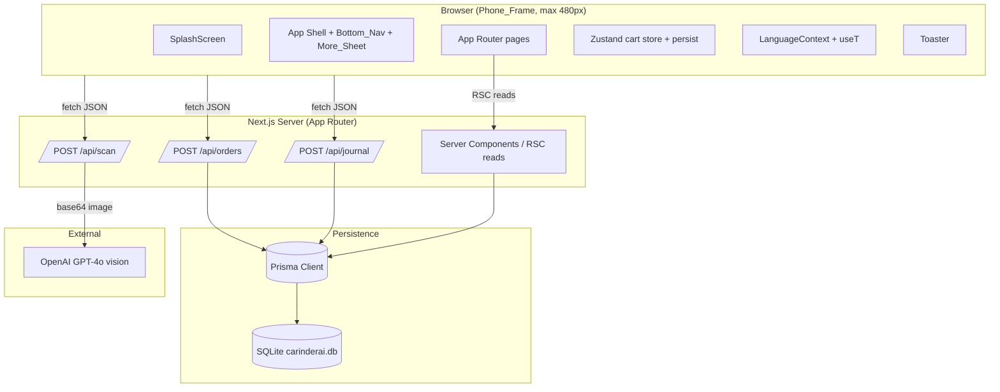
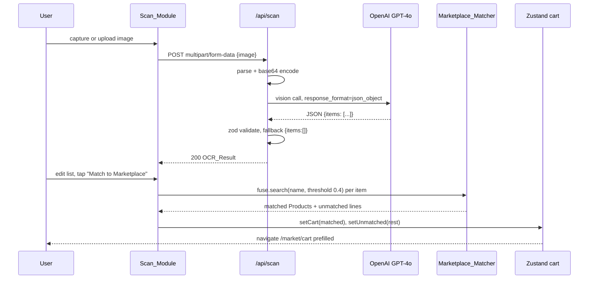
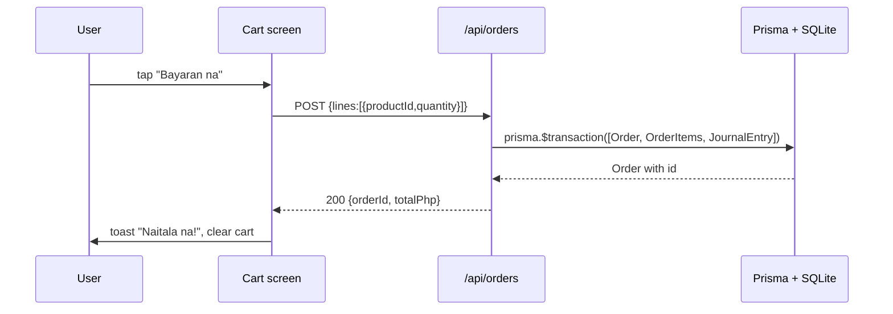

# Design Document

## Overview

CarinderAI is a mobile-first PWA delivered as a single Next.js 14 (App Router) application. The product organizes a Filipino carinderia owner's day around three pillars defined in the requirements:

- **Logistics** — `Market_Module` browsing of seeded `Supplier`s and `Product`s, a client-side `Cart`, and checkout that persists an `Order`, `OrderItem`s, and a paired `JournalEntry` (Requirements 2, 3).
- **Accounting** — `Finance_Module` listing, manual entry, dashboard summary, and 7-day chart of `JournalEntry` records (Requirements 4, 5).
- **OCR** — `Scan_Module` and `Scan_API` that turns a palengke list photo into a structured `OCR_Result` and routes the user to either marketplace matching or expense logging (Requirements 6, 7, 8).

Tier 2 surfaces (`Dashboard_Tab`, `Customer_Browse`) reuse the same data and string layers but are read-only over seeded data (Requirements 9, 10). Tier 3 surfaces (`Insights_Module`, `Tray_Tally`) are deliberately mocked (Requirements 11, 12).

The whole app is wrapped in a `Phone_Frame` shell with a `Bottom_Nav` of 5 visible tabs and a `More_Sheet` (Requirement 1). Language is handled by a hand-rolled `Strings_File` and a `LanguageContext`, persisted in localStorage under `carinderai.lang` (Requirements 13, 21). Persistence is Prisma + SQLite (Requirement 14). Vision is OpenAI GPT-4o called from `/api/scan` with `response_format: { type: 'json_object' }` (Requirement 7).

This design is scoped to the explicit non-goals in Requirement 19: no auth, no real payments, no real delivery, no i18n library, no test suite beyond the single `/api/scan` smoke test, no production deployment config.

## Architecture

### High-Level Component Diagram



### Client State Choice: Zustand

Three pieces of client state cross routes: the **cart**, the **active language**, and **transient toasts**.

- **Cart** is the trickiest: it is mutated from `Market_Module` product cards, the cart screen itself, and is *prefilled* by the scan flow ("Match to Marketplace"). It must persist across navigation between `/scan` → `/market/cart` and across reload. A React Context with reducer would work, but Zustand gives us a single store with built-in `persist` middleware (localStorage), selectors (so unrelated components don't re-render on cart changes), and trivial cross-route mutation from a non-React function (the matcher utility) — without lifting context providers up.
- **Language** state is rarely changed and read everywhere. React Context is the right tool here: a small `LanguageProvider` wrapping the app, hydrating from `localStorage['carinderai.lang']`. We keep this in Context (not Zustand) because language is a *render-time* concern with a custom hook (`useT`) rather than a mutable model.
- **Toasts** are transient. We use `react-hot-toast` (or equivalent) which ships its own store; we don't reinvent it.

Decision: **Zustand for the cart, React Context for language, `react-hot-toast` for toasts.** This satisfies Requirement 3 (cart state across routes), Requirement 8.2 (Match to Marketplace prefills the cart), Requirement 13 (language toggle persisted), and Requirement 17 (toasts on success).

### Request Flows





## Components and Interfaces

### Directory Layout

```
carinderai/
├── app/
│   ├── layout.tsx                  # PhoneFrame, providers, BottomNav, Toaster
│   ├── page.tsx                    # Dashboard_Tab (Home)
│   ├── globals.css
│   ├── market/
│   │   ├── page.tsx                # Suppliers + categories + product list
│   │   └── cart/page.tsx           # Cart + checkout
│   ├── scan/
│   │   ├── page.tsx                # Camera + upload + editable list + match/log buttons
│   │   └── components/EditableItemList.tsx
│   ├── finance/
│   │   ├── page.tsx                # Dashboard summary + 7-day chart + journal list
│   │   └── new/page.tsx            # Manual entry form
│   ├── customers/
│   │   ├── page.tsx                # 2-col grid of Carinderia cards
│   │   └── [id]/page.tsx           # Carinderia detail + MenuItems
│   ├── insights/page.tsx           # Hardcoded weather + recommendation
│   ├── tray-tally/page.tsx         # Single photo + Tally button + hardcoded receipt
│   ├── settings/page.tsx           # Language toggle
│   └── api/
│       ├── scan/route.ts           # POST /api/scan
│       ├── orders/route.ts         # POST /api/orders
│       └── journal/route.ts        # POST /api/journal
├── components/
│   ├── PhoneFrame.tsx
│   ├── BottomNav.tsx               # 5 tabs + raised 64px Scan button
│   ├── MoreSheet.tsx
│   ├── SplashScreen.tsx
│   ├── CategoryChipRow.tsx
│   ├── ProductCard.tsx
│   ├── CartLine.tsx
│   ├── JournalRow.tsx
│   ├── KpiCard.tsx
│   ├── BarChart7d.tsx              # recharts wrapper
│   ├── Toaster.tsx                 # react-hot-toast wrapper
│   ├── Spinner.tsx
│   ├── EmptyState.tsx
│   └── icons/                      # lucide-react re-exports
├── lib/
│   ├── prisma.ts                   # singleton PrismaClient
│   ├── openai.ts                   # OpenAI client factory
│   ├── currency.ts                 # formatPhp(amount): '₱X,XXX.XX'
│   ├── dates.ts                    # startOfDay, last7Days, dayOfWeekLabel
│   ├── strings.ts                  # Strings_File: en + tl key sets
│   ├── language-context.tsx        # LanguageProvider, useT()
│   ├── cart-store.ts               # Zustand store + persist middleware
│   ├── matcher.ts                  # Marketplace_Matcher (Fuse.js)
│   ├── finance.ts                  # today totals, top product, 7d chart data
│   ├── greeting.ts                 # time-of-day greeting key picker
│   └── schemas.ts                  # zod schemas for OCR, orders, journal
├── prisma/
│   ├── schema.prisma
│   ├── seed.ts
│   └── dev.db                      # gitignored
├── public/
│   ├── logo.svg
│   ├── tray-demo.jpg               # Tier 3 mocked tray photo
│   ├── manifest.webmanifest
│   └── icons/icon-192.png, icon-512.png
├── tests/
│   └── scan.smoke.test.ts          # single Vitest smoke test
├── .env.example
├── next.config.ts
├── tailwind.config.ts
├── tsconfig.json
├── package.json
└── vitest.config.ts
```

### Routing Map

| URL                    | Tab / Surface              | Page kind                | Requirement |
| ---------------------- | -------------------------- | ------------------------ | ----------- |
| `/`                    | Home → `Dashboard_Tab`     | RSC + client KPI cards   | 9           |
| `/market`              | Market → `Market_Module`   | RSC list + client filter | 2           |
| `/market/cart`         | Market → Cart              | Client (Zustand)         | 3, 8.2      |
| `/scan`                | Scan → `Scan_Module`       | Client + form action     | 6, 8        |
| `/finance`             | Finance → list + dashboard | RSC + client chart       | 4, 5        |
| `/finance/new`         | Finance → manual entry     | Client form              | 4.3–4.7, 9.6|
| `/customers`           | More → `Customer_Browse`   | RSC                      | 10.1, 10.2  |
| `/customers/[id]`      | More → Carinderia detail   | RSC                      | 10.3–10.5   |
| `/insights`            | More → `Insights_Module`   | Client (hardcoded)       | 11          |
| `/tray-tally`          | More → `Tray_Tally`        | Client (hardcoded)       | 12          |
| `/settings`            | More → `Settings_Module`   | Client (Context)         | 13          |
| `POST /api/scan`       | OCR endpoint               | Route Handler            | 7           |
| `POST /api/orders`     | Checkout endpoint          | Route Handler            | 3.4–3.7     |
| `POST /api/journal`    | Manual entry / log expense | Route Handler            | 4.4, 8.4    |

The Scan tab in `Bottom_Nav` is rendered as a 64px circular raised button with a drop shadow and orange (`#F58220`) fill, satisfying Requirement 1.4. The `More_Sheet` is a bottom sheet that lists `Customer_Browse`, `Insights_Module`, `Tray_Tally`, and `Settings_Module`, satisfying Requirement 1.5.


## Data Models

### Prisma Schema (full)

This satisfies Requirement 14 (all 7 models, SQLite provider, foreign keys, enums) and Requirement 15 (seed targets these models).

```prisma
// prisma/schema.prisma

generator client {
  provider = "prisma-client-js"
}

datasource db {
  provider = "sqlite"
  url      = env("DATABASE_URL") // e.g. "file:./dev.db"
}

enum Unit {
  kg
  pc
  L
  pack
}

enum JournalEntryType {
  REVENUE
  EXPENSE
}

model Supplier {
  id        String    @id @default(cuid())
  name      String
  logoUrl   String
  category  String
  products  Product[]
}

model Product {
  id           String       @id @default(cuid())
  supplierId   String
  supplier     Supplier     @relation(fields: [supplierId], references: [id])
  name         String
  category     String       // 'Meat & Eggs' | 'Fish' | 'Vegetables' | 'Condiments' | 'Rice/Grains'
  unit         Unit
  pricePhp     Float
  stock        Int
  imageUrl     String       // single emoji glyph per Req 14.2
  orderItems   OrderItem[]

  @@index([category])
  @@index([supplierId])
}

model Order {
  id        String       @id @default(cuid())
  status    String       // 'PLACED' (only value used in Tier 1)
  createdAt DateTime     @default(now())
  totalPhp  Float
  items     OrderItem[]
  journal   JournalEntry[] // back-relation; in practice exactly one

  @@index([createdAt])
}

model OrderItem {
  id                 String   @id @default(cuid())
  orderId            String
  order              Order    @relation(fields: [orderId], references: [id], onDelete: Cascade)
  productId          String
  product            Product  @relation(fields: [productId], references: [id])
  quantity           Float
  unitPriceSnapshot  Float

  @@index([orderId])
  @@index([productId])
}

model JournalEntry {
  id            String            @id @default(cuid())
  date          DateTime
  type          JournalEntryType
  category      String            // 'Supplies' | 'Palengke' | 'Sales' | free text for manual
  amountPhp     Float
  note          String?
  sourceOrderId String?
  sourceOrder   Order?            @relation(fields: [sourceOrderId], references: [id])

  @@index([date])
  @@index([type])
  @@index([sourceOrderId])
}

model Carinderia {
  id          String     @id @default(cuid())
  name        String
  address     String
  distanceKm  Float
  rating      Float
  priceRange  String     // e.g. '₱'..'₱₱₱'
  topDish     String
  imageUrl    String
  menuItems   MenuItem[]
}

model MenuItem {
  id            String     @id @default(cuid())
  carinderiaId  String
  carinderia    Carinderia @relation(fields: [carinderiaId], references: [id], onDelete: Cascade)
  name          String
  pricePhp      Float
}
```

Notes:
- `Unit` is an enum to satisfy Requirement 14.2's constraint on the unit field. The OCR JSON contract additionally allows `'bundle'` (Requirement 7.3, 7.5). The matcher converts `'bundle'` to `'pack'` (or treats as unmatched) before mapping to Product.unit; the Product table itself only carries `kg | pc | L | pack`.
- `JournalEntryType` is an enum to satisfy Requirement 14.5.
- `JournalEntry.sourceOrderId` is optional (Requirement 14.13); manual entries set it to `null` (Requirement 4.4).
- All FKs are explicit (Requirements 14.9–14.13).
- Design uses 'Meat & Eggs' as the unified category label; this supersedes the bare 'Meat' label in Requirement 2.2 to keep eggs in a sensible bucket.

### Server Actions / API Routes Catalog

All write operations go through Route Handlers under `app/api/*` so that the smoke test in Requirement 18 has a stable target. Read operations on RSC pages call Prisma directly through `lib/prisma.ts`.

#### `POST /api/orders` — Create Order + paired JournalEntry transactionally

Implements Requirement 3.4–3.8 and Requirement 17.4.

**Input (zod):**

```ts
// lib/schemas.ts
export const CreateOrderInput = z.object({
  lines: z.array(z.object({
    productId: z.string().min(1),
    quantity: z.number().positive().min(0.01),
  })).min(1),
});
```

**Output:**

```ts
// 200
{ orderId: string, totalPhp: number, journalEntryId: string }
// 400 invalid input
{ error: string, issues?: ZodIssue[] }
// 404 unknown productId
{ error: 'Product not found', productId: string }
// 500 db failure
{ error: 'Internal error' }
```

**Handler shape:**

```ts
export async function POST(req: NextRequest) {
  const body = CreateOrderInput.parse(await req.json());
  const productIds = body.lines.map(l => l.productId);
  const products = await prisma.product.findMany({ where: { id: { in: productIds } } });
  if (products.length !== productIds.length) return NextResponse.json({ error: 'Product not found' }, { status: 404 });

  const totalPhp = body.lines.reduce((sum, l) => {
    const p = products.find(p => p.id === l.productId)!;
    return sum + p.pricePhp * l.quantity;
  }, 0);

  const result = await prisma.$transaction(async (tx) => {
    const order = await tx.order.create({
      data: {
        status: 'PLACED',
        totalPhp,
        items: {
          create: body.lines.map(l => {
            const p = products.find(p => p.id === l.productId)!;
            return { productId: l.productId, quantity: l.quantity, unitPriceSnapshot: p.pricePhp };
          }),
        },
      },
    });
    const journal = await tx.journalEntry.create({
      data: {
        date: order.createdAt,
        type: 'EXPENSE',
        category: 'Supplies',
        amountPhp: order.totalPhp,
        note: `Order ${order.id}`,
        sourceOrderId: order.id,
      },
    });
    return { orderId: order.id, totalPhp: order.totalPhp, journalEntryId: journal.id };
  });

  return NextResponse.json(result);
}
```

The transactional pairing of `Order` + `JournalEntry` is what makes Requirement 3.7 a hard invariant rather than a hope.

#### `POST /api/journal` — Manual entry or "Log as Expense" from Scan

Implements Requirement 4.3–4.7 and Requirement 8.4–8.5.

**Input (zod):**

```ts
export const CreateJournalInput = z.object({
  date: z.coerce.date(),
  type: z.enum(['REVENUE', 'EXPENSE']),
  category: z.string().min(1),
  amountPhp: z.number().positive(),  // Req 4.5: must be > 0
  note: z.string().optional(),
});
```

**Output:**

```ts
// 200 { id: string }
// 400 { error: 'Invalid input', issues: ZodIssue[] }
// 500 { error: 'Internal error' }
```

**Error cases:** invalid type, non-positive amount, missing required field — each surfaces via the zod issues list and the form maps issue paths to inline field errors.

#### `POST /api/scan` — OCR endpoint

See full design under "Scan_API Detailed Design" below. Implements Requirement 7.

#### Helpers (RSC reads)

These are not API routes; they are functions in `lib/finance.ts` consumed by server components.

- `getTodayKpis()` → `{ salesPhp: number, expensesPhp: number, netPhp: number, topProduct: string | null }` (Requirement 5.1–5.4, 5.6)
- `getLast7DaysChartData()` → `Array<{ dayLabel: 'Mon'|...|'Sun', revenue: number, expense: number }>` (Requirement 5.5)
- `getJournalEntries()` → `JournalEntry[]` ordered by `date` desc (Requirement 4.1)


### Scan_API Detailed Design

Implements Requirement 7 in full.

**1. Multipart parsing.** Next.js 14 Route Handlers expose `req.formData()` natively. We pull the `image` field, type-assert it to `File`, and reject if missing.

```ts
const form = await req.formData();
const file = form.get('image');
if (!(file instanceof File)) {
  return NextResponse.json({ error: 'Missing image field' }, { status: 400 }); // Req 7.7
}
```

**2. Env check.**

```ts
const apiKey = process.env.OPENAI_API_KEY;
if (!apiKey) {
  return NextResponse.json({ error: 'Server misconfiguration: OPENAI_API_KEY not set' }, { status: 500 }); // Req 7.8
}
```

**3. Base64 conversion.**

```ts
const buf = Buffer.from(await file.arrayBuffer());
const mime = file.type || 'image/jpeg';
const dataUrl = `data:${mime};base64,${buf.toString('base64')}`;
```

**4. OpenAI call.** Uses the official `openai` SDK with `model: 'gpt-4o'`, `response_format: { type: 'json_object' }` (Requirement 7.10), and the verbatim system prompt from Requirement 7.3.

```ts
const SYSTEM_PROMPT = "You are an OCR assistant for a Filipino carinderia palengke list. Extract items, quantities, and units. Return ONLY valid JSON matching: {items: [{name: string, quantity: number, unit: 'kg'|'pc'|'L'|'pack'|'bundle', note?: string}]}. Translate Tagalog item names to English in a 'translated' field. If unreadable, return {items: []}.";

const completion = await openai.chat.completions.create({
  model: 'gpt-4o',
  response_format: { type: 'json_object' },
  messages: [
    { role: 'system', content: SYSTEM_PROMPT },
    {
      role: 'user',
      content: [
        { type: 'text', text: 'Extract the items from this palengke list.' },
        { type: 'image_url', image_url: { url: dataUrl } },
      ],
    },
  ],
});
const raw = completion.choices[0]?.message?.content ?? '{"items":[]}';
```

**5. JSON parse + zod validation with safe fallback.**

```ts
export const OcrItem = z.object({
  name: z.string(),
  quantity: z.number(),
  unit: z.enum(['kg', 'pc', 'L', 'pack', 'bundle']),
  note: z.string().optional(),
  translated: z.string().optional(),
});
export const OcrResult = z.object({ items: z.array(OcrItem) });

let parsed: { items: unknown[] };
try { parsed = JSON.parse(raw); } catch { return NextResponse.json({ items: [] }); } // Req 7.6
const result = OcrResult.safeParse(parsed);
return NextResponse.json(result.success ? result.data : { items: [] }); // Req 7.6
```

**6. Response status.** Always 200 on the happy path *and* on parse fallback (Requirement 7.5, 7.6). 400 only when the `image` field is missing (Requirement 7.7). 500 only when the API key is unset (Requirement 7.8).

**7. `.env.example`** ships with `OPENAI_API_KEY=` (Requirement 7.9).

### Marketplace_Matcher Design

Implements Requirement 8.1–8.3.

```ts
// lib/matcher.ts
import Fuse from 'fuse.js';
import type { Product } from '@prisma/client';
import type { z } from 'zod';
import type { OcrItem } from './schemas';

export function buildFuseIndex(products: Product[]) {
  return new Fuse(products, { keys: ['name'], threshold: 0.4, includeScore: true });
}

export interface MatchedLine { product: Product; quantity: number; confidence: number; }
export interface UnmatchedLine { ocrItem: z.infer<typeof OcrItem>; }

export function matchOcrItems(
  fuse: Fuse<Product>,
  items: z.infer<typeof OcrItem>[],
): { matched: MatchedLine[]; unmatched: UnmatchedLine[] } {
  const matched: MatchedLine[] = [];
  const unmatched: UnmatchedLine[] = [];
  for (const item of items) {
    const query = item.translated ?? item.name;
    const hit = fuse.search(query)[0];
    if (hit) {
      matched.push({
        product: hit.item,
        quantity: Math.max(0.01, item.quantity),
        confidence: 1 - (hit.score ?? 0),
      });
    } else {
      unmatched.push({ ocrItem: item });
    }
  }
  return { matched, unmatched };
}
```

The matcher is constructed in the browser from the seeded Product list fetched once on `/scan` mount (small payload, ~30 rows). Matches at score ≤ 0.4 are returned as `MatchedLine`; everything else is funnelled into `unmatched` and shown on the cart screen as a separate "unmatched" list excluded from the cart total (Requirement 8.3).

### Cart State Design (Zustand)

Implements Requirement 3 (cart manipulation, totals) and Requirement 8.2 (Match prefill).

```ts
// lib/cart-store.ts
import { create } from 'zustand';
import { persist } from 'zustand/middleware';

export interface CartLine {
  productId: string;
  name: string;
  unit: 'kg' | 'pc' | 'L' | 'pack';
  pricePhp: number;
  imageUrl: string;       // emoji glyph
  quantity: number;       // positive float ≥ 0.01
}

export interface UnmatchedLine {
  name: string;
  quantity: number;
  unit: string;
  note?: string;
}

interface CartState {
  lines: CartLine[];
  unmatched: UnmatchedLine[];
  addProduct: (line: Omit<CartLine, 'quantity'>, qty?: number) => void;
  setQuantity: (productId: string, qty: number) => void;
  removeProduct: (productId: string) => void;
  clear: () => void;
  prefillFromScan: (matched: CartLine[], unmatched: UnmatchedLine[]) => void;
  totalPhp: () => number;
}

export const useCart = create<CartState>()(
  persist(
    (set, get) => ({
      lines: [],
      unmatched: [],
      addProduct: (line, qty = 1) => set(state => {
        const existing = state.lines.find(l => l.productId === line.productId);
        if (existing) {
          return { lines: state.lines.map(l =>
            l.productId === line.productId ? { ...l, quantity: l.quantity + qty } : l) };
        }
        return { lines: [...state.lines, { ...line, quantity: qty }] };
      }),
      setQuantity: (productId, qty) => set(state => ({
        lines: state.lines.map(l => l.productId === productId
          ? { ...l, quantity: Math.max(0.01, qty) } : l),
      })),
      removeProduct: (productId) => set(state => ({
        lines: state.lines.filter(l => l.productId !== productId),
      })),
      clear: () => set({ lines: [], unmatched: [] }),
      prefillFromScan: (matched, unmatched) => set({ lines: matched, unmatched }),
      totalPhp: () => get().lines.reduce((s, l) => s + l.pricePhp * l.quantity, 0),
    }),
    { name: 'carinderai.cart' },
  ),
);
```

The `prefillFromScan` action is what `Match to Marketplace` calls before navigating to `/market/cart`, satisfying Requirement 8.2. Persistence under `carinderai.cart` survives reload but is cleared on successful checkout (Requirement 3.8).

### Finance Computations

Implements Requirement 5.

```ts
// lib/finance.ts
import { startOfDay, endOfDay, subDays, format } from 'date-fns';

export async function getTodayKpis() {
  const start = startOfDay(new Date());
  const end = endOfDay(new Date());
  const entries = await prisma.journalEntry.findMany({
    where: { date: { gte: start, lte: end } },
  });
  const salesPhp = entries.filter(e => e.type === 'REVENUE').reduce((s, e) => s + e.amountPhp, 0);
  const expensesPhp = entries.filter(e => e.type === 'EXPENSE').reduce((s, e) => s + e.amountPhp, 0);
  const netPhp = salesPhp - expensesPhp;

  // top product across today's Orders
  const items = await prisma.orderItem.findMany({
    where: { order: { createdAt: { gte: start, lte: end } } },
    include: { product: true },
  });
  const totals = new Map<string, { name: string; qty: number }>();
  for (const it of items) {
    const cur = totals.get(it.productId) ?? { name: it.product.name, qty: 0 };
    cur.qty += it.quantity;
    totals.set(it.productId, cur);
  }
  let topProduct: string | null = null;
  let topQty = 0;
  for (const v of totals.values()) {
    if (v.qty > topQty) { topQty = v.qty; topProduct = v.name; }
  }
  return { salesPhp, expensesPhp, netPhp, topProduct };
}

export async function getLast7DaysChartData() {
  const today = new Date();
  const days = Array.from({ length: 7 }, (_, i) => subDays(today, 6 - i)); // oldest → today
  const start = startOfDay(days[0]);
  const end = endOfDay(days[6]);
  const entries = await prisma.journalEntry.findMany({
    where: { date: { gte: start, lte: end } },
  });
  return days.map(d => {
    const day = startOfDay(d).getTime();
    const revenue = entries
      .filter(e => startOfDay(e.date).getTime() === day && e.type === 'REVENUE')
      .reduce((s, e) => s + e.amountPhp, 0);
    const expense = entries
      .filter(e => startOfDay(e.date).getTime() === day && e.type === 'EXPENSE')
      .reduce((s, e) => s + e.amountPhp, 0);
    return { dayLabel: format(d, 'EEE') as 'Mon'|'Tue'|'Wed'|'Thu'|'Fri'|'Sat'|'Sun', revenue, expense };
  });
}
```

The chart shape `{ dayLabel, revenue, expense }[]` plugs straight into a recharts `BarChart` with two `Bar` series (Requirement 5.5). When today has no entries, KPIs render as `₱0.00` with the placeholder string for `topProduct` (Requirement 5.6).


### UI Component Inventory

| Component             | Purpose                                                                  | Used by                      | Requirement     |
| --------------------- | ------------------------------------------------------------------------ | ---------------------------- | --------------- |
| `PhoneFrame`          | Centered max-w-[480px] container, rounded border + shadow > 480px        | Root layout                  | 1.1, 1.2, 1.7   |
| `BottomNav`           | 5 visible tabs; raised 64px Scan button with `shadow-xl` orange fill; More tab toggles MoreSheet visibility via local React `useState` (no navigation) | Root layout                  | 1.3, 1.4, 1.5   |
| `MoreSheet`           | Bottom sheet listing Customers, Insights, Tray Tally, Settings           | `/more`                      | 1.5             |
| `SplashScreen`        | Logo + cream background; conditionally rendered inside root layout based on a `sessionStorage` flag (`carinderai.splashShown`); no dedicated route | Root layout                  | 1.8             |
| `CategoryChipRow`     | Horizontal scrolling chips: All, Meat & Eggs, Fish, Vegetables, Condiments, Rice/Grains | `/market`              | 2.7             |
| `ProductCard`         | Emoji glyph, name, unit, ₱ price, stock, "Add to cart"                   | `/market`                    | 2.4, 3.1        |
| `CartLine`            | Emoji + name + qty stepper + line total                                  | `/market/cart`               | 3.2, 3.3        |
| `JournalRow`          | Date · type pill · category · ₱ amount · note                            | `/finance`                   | 4.2             |
| `KpiCard`             | Label + ₱ value, used for sales/expenses/net/top-product                 | `/`, `/finance`              | 5.1, 9.2        |
| `BarChart7d`          | recharts wrapper, 7 day-of-week labels, two series                       | `/finance`                   | 5.5             |
| `Toaster`             | `react-hot-toast` provider, brand-tinted                                 | Root layout                  | 17.4, 17.5      |
| `Spinner`             | Centered spinner with optional label                                     | Scan, Cart, Finance forms    | 17.2, 17.3      |
| `EmptyState`          | Friendly Filipino copy + optional CTA                                    | All list views with no data  | 2.6, 4.8, 17.1  |
| `SplashScreen`        | (above)                                                                  |                              |                 |

`BottomNav` implementation note: it uses CSS Grid with 5 cells; the middle cell hosts a `<button>` with `position: absolute; bottom: 12px; height: 64px; width: 64px; border-radius: 9999px; background: #F58220; box-shadow: 0 8px 24px rgba(0,0,0,0.25);` — fulfilling the "raised, drop-shadow, 64px" specifics of Requirement 1.4.

### Styling System

Implements Requirement 1.7 and Requirement 16.

```ts
// tailwind.config.ts
export default {
  content: ['./app/**/*.{ts,tsx}', './components/**/*.{ts,tsx}'],
  theme: {
    extend: {
      colors: {
        primary: '#F58220',           // Req 1.7
        cream:   '#FFF4E6',           // Req 1.7
        ink:     '#1F1B16',
        muted:   '#7A6F66',
        success: '#2E7D32',
        danger:  '#C62828',
      },
      fontFamily: {
        sans: ['Inter', 'system-ui', 'sans-serif'],
      },
      boxShadow: {
        scan: '0 8px 24px rgba(0,0,0,0.25)', // Bottom_Nav scan button
        card: '0 2px 6px rgba(0,0,0,0.06)',
      },
    },
  },
};
```

```ts
// lib/currency.ts
export function formatPhp(amount: number): string {
  return `₱${new Intl.NumberFormat('en-PH', { minimumFractionDigits: 2, maximumFractionDigits: 2 }).format(amount)}`;
}
```

Examples:

| Input        | Output       |
| ------------ | ------------ |
| `0`          | `₱0.00`      |
| `15`         | `₱15.00`     |
| `1500`       | `₱1,500.00`  |
| `1234567.5`  | `₱1,234,567.50` |
| `40 + 15`    | `₱55.00` (Tray_Tally hardcoded receipt, Req 12.3) |

This formatter is the single source of currency rendering across `Market_Module`, `Finance_Module`, `Scan_Module`, `Dashboard_Tab`, `Customer_Browse`, and `Tray_Tally` (Requirement 16.2).

### Strings System

Implements Requirements 13 and 21. No third-party i18n library — that is an explicit non-goal in Requirement 19.4.

```ts
// lib/strings.ts
export type Lang = 'en' | 'tl';

export const STRINGS = {
  en: {
    order_success_toast: 'Recorded!',
    entry_success_toast: 'Done!',
    empty_cart: "Your basket is empty. Add something!",
    empty_journal: "No records yet. Scan or log one!",
    greeting_morning: 'Good morning!',
    greeting_afternoon: 'Good afternoon!',
    greeting_evening: 'Good evening!',
    cta_checkout: 'Check out',
    cta_scan: 'Scan list',
    cta_match: 'Match to Market',
    cta_log_expense: 'Log as expense',
    // ...other UI labels (tab names, headings, form labels, etc.)
  },
  tl: {
    // Verbatim Tagalog values from Requirement 21
    order_success_toast: 'Naitala na!',
    entry_success_toast: 'Tapos na!',
    empty_cart: 'Wala pang laman ang basket mo. Mag-add ka na!',
    empty_journal: 'Wala pang record. Mag-scan o mag-log ka na!',
    greeting_morning: 'Magandang umaga!',
    greeting_afternoon: 'Magandang hapon!',
    greeting_evening: 'Magandang gabi!',
    cta_checkout: 'Bayaran na',
    cta_scan: 'I-scan ang listahan',
    cta_match: 'I-match sa Market',
    cta_log_expense: 'I-log bilang gastos',
  },
} as const;

export type StringKey = keyof typeof STRINGS['en'];
```

```ts
// lib/language-context.tsx
'use client';
import { createContext, useContext, useEffect, useState } from 'react';
import { STRINGS, type Lang, type StringKey } from './strings';

const LanguageContext = createContext<{ lang: Lang; setLang: (l: Lang) => void }>({
  lang: 'en', setLang: () => {},
});

export function LanguageProvider({ children }: { children: React.ReactNode }) {
  const [lang, setLangState] = useState<Lang>('en'); // Req 13.4 default
  useEffect(() => {
    const stored = localStorage.getItem('carinderai.lang') as Lang | null;
    if (stored === 'en' || stored === 'tl') setLangState(stored);
  }, []);
  const setLang = (l: Lang) => {
    setLangState(l);
    localStorage.setItem('carinderai.lang', l); // Req 13.5
  };
  return <LanguageContext.Provider value={{ lang, setLang }}>{children}</LanguageContext.Provider>;
}

export function useT() {
  const { lang } = useContext(LanguageContext);
  return (key: StringKey) => STRINGS[lang][key] ?? STRINGS.en[key];
}

export function useLang() { return useContext(LanguageContext); }
```

The 11 microcopy keys above are pinned verbatim per Requirement 21. The toggle in `Settings_Module` calls `setLang('en' | 'tl')`, which both updates the Context value (re-rendering visible text) and persists to `localStorage['carinderai.lang']` (Requirements 13.2, 13.5).


### Seed Plan

Implements Requirement 15. The seed script in `prisma/seed.ts` runs on `prisma db seed`.

#### Suppliers (exactly 6, Req 15.2)

| # | Name             | Category               | logoUrl (placeholder)        |
| - | ---------------- | ---------------------- | ---------------------------- |
| 1 | Magnolia Meats   | Meat                   | `/suppliers/magnolia.svg`    |
| 2 | Dizon Farms      | Vegetables             | `/suppliers/dizon.svg`       |
| 3 | Bounty Fresh     | Poultry & Fish         | `/suppliers/bounty.svg`      |
| 4 | NutriAsia        | Condiments             | `/suppliers/nutriasia.svg`   |
| 5 | Pure Foods       | Meat (processed)       | `/suppliers/purefoods.svg`   |
| 6 | Farm Fresh       | Produce & Grains         | `/suppliers/farmfresh.svg` |

#### Products (28 entries, satisfies 25–30 in Req 15.3)

Categories are constrained to {Meat & Eggs, Fish, Vegetables, Condiments, Rice/Grains}; `unit` is from `{kg, pc, L, pack}`; `imageUrl` is a single emoji glyph (Req 14.2).

| # | Name           | Category     | Unit | Price (₱) | Stock | Emoji | Supplier        |
| - | -------------- | ------------ | ---- | --------- | ----- | ----- | --------------- |
| 1 | Pork belly     | Meat & Eggs  | kg   | 360.00    | 25    | 🥓    | Magnolia Meats  |
| 2 | Pork shoulder  | Meat & Eggs  | kg   | 320.00    | 20    | 🍖    | Magnolia Meats  |
| 3 | Chicken whole  | Meat & Eggs  | pc   | 250.00    | 30    | 🐔    | Bounty Fresh    |
| 4 | Chicken breast | Meat & Eggs  | kg   | 280.00    | 24    | 🍗    | Bounty Fresh    |
| 5 | Ground beef    | Meat & Eggs  | kg   | 420.00    | 12    | 🥩    | Pure Foods      |
| 6 | Bangus         | Fish         | pc   | 180.00    | 40    | 🐟    | Bounty Fresh    |
| 7 | Tilapia        | Fish         | kg   | 200.00    | 30    | 🐠    | Bounty Fresh    |
| 8 | Itlog          | Meat & Eggs  | pack | 240.00    | 50    | 🥚    | Pure Foods      |
| 9 | Kangkong       | Vegetables   | pack | 30.00     | 60    | 🥬    | Dizon Farms     |
| 10| Pechay         | Vegetables   | pack | 35.00     | 60    | 🥬    | Dizon Farms     |
| 11| Sitaw          | Vegetables   | pack | 40.00     | 50    | 🌱    | Dizon Farms     |
| 12| Kalabasa       | Vegetables   | kg   | 60.00     | 30    | 🎃    | Farm Fresh      |
| 13| Talong         | Vegetables   | kg   | 70.00     | 30    | 🍆    | Farm Fresh      |
| 14| Sibuyas        | Vegetables   | kg   | 120.00    | 40    | 🧅    | Dizon Farms     |
| 15| Bawang         | Vegetables   | kg   | 180.00    | 25    | 🧄    | Dizon Farms     |
| 16| Kamatis        | Vegetables   | kg   | 80.00     | 35    | 🍅    | Farm Fresh      |
| 17| Kanin/Bigas    | Rice/Grains  | kg   | 55.00     | 200   | 🍚    | Farm Fresh      |
| 18| Mantika        | Condiments   | L    | 95.00     | 40    | 🛢️    | NutriAsia       |
| 19| Toyo           | Condiments   | L    | 65.00     | 40    | 🍶    | NutriAsia       |
| 20| Suka           | Condiments   | L    | 55.00     | 40    | 🧪    | NutriAsia       |
| 21| Patis          | Condiments   | L    | 70.00     | 30    | 🐟    | NutriAsia       |
| 22| Asin           | Condiments   | pack | 25.00     | 80    | 🧂    | NutriAsia       |
| 23| Paminta        | Condiments   | pack | 40.00     | 60    | 🌶️    | NutriAsia       |
| 24| Gatas          | Condiments   | L    | 110.00    | 20    | 🥛    | Pure Foods      |
| 25| Atsuete        | Condiments   | pack | 35.00     | 40    | 🌶️    | NutriAsia       |
| 26| Laurel         | Condiments   | pack | 30.00     | 40    | 🍃    | NutriAsia       |
| 27| Mais (corn)    | Rice/Grains  | kg   | 70.00     | 30    | 🌽    | Farm Fresh      |
| 28| Munggo         | Rice/Grains  | kg   | 95.00     | 25    | 🫘    | Farm Fresh      |

#### Carinderias (exactly 4, Req 15.5) — Makati names

| # | Name                  | Address (Makati)         | distanceKm | rating | priceRange | topDish        |
| - | --------------------- | ------------------------ | ---------- | ------ | ---------- | -------------- |
| 1 | Aling Nena's Carinderia | Brgy. Poblacion       | 0.4        | 4.6    | ₱          | Pork sinigang  |
| 2 | Tita Beth's Lutong Bahay | Brgy. Bel-Air          | 1.1        | 4.4    | ₱          | Adobo          |
| 3 | Mang Pedro's Turo-Turo | Brgy. Guadalupe Nuevo  | 1.8        | 4.2    | ₱          | Bistek         |
| 4 | Lola Cora's Kitchen     | Brgy. San Antonio     | 2.4        | 4.8    | ₱₱         | Kare-kare      |

#### MenuItems (≥3 per Carinderia, Req 15.6) — example for Aling Nena's

| Carinderia          | Menu                                                                |
| ------------------- | ------------------------------------------------------------------- |
| Aling Nena's        | Sinigang ₱85, Adobo ₱75, Tortang Talong ₱45, Kanin ₱15              |
| Tita Beth's         | Adobo ₱70, Tinola ₱70, Pinakbet ₱60, Kanin ₱15                      |
| Mang Pedro's        | Bistek ₱90, Bicol Express ₱85, Ginisang Munggo ₱55, Kanin ₱15       |
| Lola Cora's         | Kare-kare ₱110, Crispy Pata ₱180, Lechon Kawali ₱130, Kanin ₱15     |

#### JournalEntries (last 7 days, mix of REVENUE + EXPENSE, Req 15.7)

For each of the 7 most recent calendar days (today inclusive) the seed creates:

- 1–3 REVENUE entries with categories `Sales` (e.g., "Lunch sales", "Dinner sales") between ₱600 and ₱4,500.
- 1–2 EXPENSE entries with categories drawn from `Supplies`, `Palengke`, `Utilities`, `LPG`, between ₱150 and ₱1,200.
- For "today", at least one EXPENSE attached to a seeded `Order` (`sourceOrderId` set) so the auto-journaling invariant has a concrete row on first launch.

This guarantees Req 15.8: a non-empty Finance list and a non-empty 7-day chart on first launch.

### Error Handling Matrix

| Surface                        | Failure mode                                  | User-visible behavior                                                       | Requirement      |
| ------------------------------ | --------------------------------------------- | --------------------------------------------------------------------------- | ---------------- |
| `POST /api/scan`               | Missing `image` form field                    | HTTP 400 `{error}`; client toast "No image"                                 | 7.7              |
| `POST /api/scan`               | `OPENAI_API_KEY` not set                      | HTTP 500 `{error}`; client toast "Server config issue"                      | 7.8              |
| `POST /api/scan`               | OpenAI throws or returns non-JSON / unparseable | HTTP 200 `{items: []}`; Scan_Module shows empty-state + retake CTA        | 7.6, 6.7         |
| `POST /api/scan`               | OpenAI returns JSON failing zod               | HTTP 200 `{items: []}` (safe parse fallback)                                | 7.6              |
| `Scan_Module` upload control   | Network error / non-200                       | Error toast; submission controls re-enabled                                 | 6.8              |
| `POST /api/orders`             | Empty `lines` array                           | HTTP 400; checkout button stays disabled (Req 3.10 prevents reaching here)  | 3.10             |
| `POST /api/orders`             | Unknown `productId`                           | HTTP 404; toast "Product not found"; cart not cleared                       | —                |
| `POST /api/orders`             | DB transaction failure                        | HTTP 500; toast "Hindi natuloy"; cart preserved                             | —                |
| `Cart` UI                      | Empty cart                                    | Checkout disabled; `EmptyState` with `empty_cart` Tagalog string            | 3.10, 17.1       |
| `Cart` UI                      | Checkout in flight                            | Spinner shown; checkout button disabled                                     | 3.9, 17.3        |
| `POST /api/journal`            | `amountPhp ≤ 0`                               | HTTP 400; inline field error on amount input                                | 4.5              |
| `POST /api/journal`            | Missing required field                        | HTTP 400 with zod path; inline error on the missing field                   | 4.6              |
| `Finance_Module` list          | Zero entries                                  | `EmptyState` with `empty_journal` Tagalog string                            | 4.8, 17.1        |
| `Market_Module` filtered list  | Zero matches                                  | `EmptyState` with friendly Filipino copy                                    | 2.6, 17.1        |
| `Customer_Browse` menu list    | Zero items (shouldn't happen post-seed)       | `EmptyState`                                                                | 17.1             |
| Language load                  | Stored value invalid                          | Fall back to English (Req 13.4)                                             | 13.4             |

### Smoke Test Design

Implements Requirement 18.

```ts
// tests/scan.smoke.test.ts
import { describe, it, expect } from 'vitest';
import fs from 'node:fs';
import path from 'node:path';
import { POST } from '../app/api/scan/route';
import { OcrResult } from '../lib/schemas';

describe('POST /api/scan smoke', () => {
  it('returns 200 with OCR_Result-shaped JSON for a sample image', async () => {
    const sample = fs.readFileSync(path.join(__dirname, 'fixtures/palengke-list.jpg'));
    const file = new File([sample], 'palengke-list.jpg', { type: 'image/jpeg' });
    const form = new FormData();
    form.set('image', file);
    const req = new Request('http://localhost/api/scan', { method: 'POST', body: form });

    const res = await POST(req as any);
    expect(res.status).toBe(200);
    const body = await res.json();
    const parsed = OcrResult.safeParse(body);
    expect(parsed.success).toBe(true);
  });
});
```

`vitest.config.ts` sets `environment: 'node'`. The test needs `OPENAI_API_KEY` to actually hit the model; in CI we either provide it as a secret or mock the OpenAI client at the module boundary. This is the *only* automated test in the repository (Requirement 18.3).


## Correctness Properties

*A property is a characteristic or behavior that should hold true across all valid executions of a system — essentially, a formal statement about what the system should do. Properties serve as the bridge between human-readable specifications and machine-verifiable correctness guarantees.*

CarinderAI is a mixed feature: the OCR pipeline, cart math, finance computations, and matcher are pure logic that benefit from property thinking, while the rendered UI and seeded mocks (Tier 2/3) are example-tested. Per Requirement 18, only one automated test ships (the `/api/scan` smoke test); the properties below are nonetheless the executable invariants the implementation must uphold and the natural targets if testing scope ever expands.

### Property 1: Cart total invariant

*For any* cart state with both matched lines and unmatched (scan-passthrough) lines, `cart.totalPhp()` equals the sum of `pricePhp × quantity` across the matched lines only, and ignores all unmatched lines.

**Validates: Requirements 3.3, 8.3**

### Property 2: Cart quantity is a positive float ≥ 0.01

*For any* call to `setQuantity(productId, q)` with any real-valued `q`, the persisted line quantity is `max(0.01, q)`; for any call to `addProduct(line)` without an explicit quantity, the resulting line has `quantity === 1`.

**Validates: Requirements 3.1, 3.2**

### Property 3: Empty cart disables checkout

*For any* cart state, the Checkout button's `disabled` attribute equals `lines.length === 0`.

**Validates: Requirements 3.10**

### Property 4: Checkout transactionality (auto-journaling)

*For any* non-empty cart submitted to `POST /api/orders`, a successful response implies that the database now contains:
1. exactly one new `Order` with `status === 'PLACED'` and `totalPhp === sum(pricePhp × quantity)` over the input lines;
2. exactly one `OrderItem` per input line with the same `productId`, `quantity`, and `unitPriceSnapshot` equal to the Product's `pricePhp` at submission time;
3. exactly one new `JournalEntry` with `type === 'EXPENSE'`, `category === 'Supplies'`, `amountPhp === Order.totalPhp`, `date === Order.createdAt`, and `sourceOrderId === Order.id`.

**Validates: Requirements 3.4, 3.5, 3.6, 3.7**

### Property 5: Manual journal round-trip

*For any* valid `CreateJournalInput` payload (positive amount, valid type, all required fields), `POST /api/journal` followed by reading the row back yields a `JournalEntry` whose fields equal the submitted values, with `sourceOrderId === null`.

**Validates: Requirements 4.4**

### Property 6: Manual journal rejects non-positive amounts

*For any* `CreateJournalInput` payload with `amountPhp ≤ 0`, `POST /api/journal` returns a 400 error and no `JournalEntry` row is created.

**Validates: Requirements 4.5**

### Property 7: Journal listing is sorted by date descending

*For any* set of persisted `JournalEntry` rows, `getJournalEntries()` returns them in non-increasing `date` order.

**Validates: Requirements 4.1**

### Property 8: Today's KPIs match their definitions

*For any* set of persisted `JournalEntry` rows, `getTodayKpis()` returns:
- `salesPhp` = sum of `amountPhp` over entries where `type === 'REVENUE'` and `date` falls in today's local-day window;
- `expensesPhp` = sum of `amountPhp` over entries where `type === 'EXPENSE'` and `date` falls in today's local-day window;
- `netPhp` = `salesPhp − expensesPhp`;
- `topProduct` = name of the Product with the maximum total `quantity` across all `OrderItem`s whose parent `Order.createdAt` is in today's window, or a placeholder string if there are no such items.

**Validates: Requirements 5.1, 5.2, 5.3, 5.4, 5.6, 9.2**

### Property 9: 7-day chart shape and per-day correctness

*For any* set of persisted `JournalEntry` rows, `getLast7DaysChartData()` returns an array of length 7 whose `dayLabel` values are the chronological day-of-week labels for the 7 most recent calendar days ending today, and whose `revenue`/`expense` values for each day equal the sum of `REVENUE`/`EXPENSE` `amountPhp` for `JournalEntry`s falling within that day's local window.

**Validates: Requirements 5.5**

### Property 10: Scan API parse fallback

*For any* invocation of `POST /api/scan` where the OpenAI response is missing, malformed JSON, or fails the `OcrResult` zod schema, the route responds with HTTP 200 and a body deeply equal to `{ items: [] }`.

**Validates: Requirements 7.6**

### Property 11: Marketplace matcher honors threshold 0.4

*For any* OCR item and any seeded Product list, `matchOcrItems` returns the OCR item in the `matched` array if and only if there exists a Product whose Fuse.js score against the item's `translated` (or `name`) field is ≤ 0.4; otherwise it appears in `unmatched`.

**Validates: Requirements 8.1**

### Property 12: Match-prefill round-trip

*For any* successful match, calling `prefillFromScan(matched, unmatched)` results in `useCart().lines` having one entry per matched item with `productId` equal to the matched Product's id and `quantity` equal to `max(0.01, ocrItem.quantity)` (a positive float, minimum 0.01), and `useCart().unmatched` deeply equal to the input `unmatched` array.

**Validates: Requirements 8.2**

### Property 13: Log-as-expense entry shape

*For any* user-entered total `amountPhp > 0` and any non-empty list of scanned items, the "Log as Expense" flow creates exactly one `JournalEntry` with `type === 'EXPENSE'`, `category === 'Palengke'`, `note` summarizing the scanned items, `amountPhp` equal to the user-entered total, and `sourceOrderId === null`.

**Validates: Requirements 8.4**

### Property 14: Greeting matches time of day

*For any* local clock time `t`, `pickGreetingKey(t)` returns `'greeting_morning'` for `t.hour ∈ [4, 11]`, `'greeting_afternoon'` for `t.hour ∈ [12, 17]`, and `'greeting_evening'` otherwise.

**Validates: Requirements 9.1**

### Property 15: Filtered product lists only contain matches

*For any* set of seeded Products and any selected category `c` ∈ {Meat & Eggs, Fish, Vegetables, Condiments, Rice/Grains}, the rendered Market list contains exactly the Products whose `category === c`; for any selected supplier `s`, the list contains exactly the Products whose `supplierId === s.id`. Furthermore, every rendered ProductCard's text contains the product's name, unit, ₱-formatted price, and stock.

**Validates: Requirements 2.3, 2.4, 2.5**

### Property 16: Carinderia rendering invariant

*For any* seeded `Carinderia`, its card on the customer browse grid renders the carinderia's name, distanceKm, topDish, rating, and priceRange, and its detail page renders all of its associated `MenuItem`s with their names and ₱-formatted prices.

**Validates: Requirements 10.2, 10.3**

### Property 17: Currency formatting invariant

*For any* finite real number `n`, `formatPhp(n)` returns a string that:
1. starts with the `₱` glyph;
2. has exactly two digits after the final `.`;
3. groups the integer part with `,` thousands separators when `|n| ≥ 1000`.

**Validates: Requirements 16.1**

### Property 18: Language toggle round-trip and re-render

*For any* language `L ∈ {'en', 'tl'}` and any string key `k` defined in `STRINGS.en`, calling `setLang(L)` causes `useT()(k)` to return `STRINGS[L][k]`, and the value `localStorage['carinderai.lang']` equals `L`. After a reload, `useT()(k)` continues to return `STRINGS[L][k]`.

**Validates: Requirements 13.2, 13.5**

### Property 19: Microcopy catalog is verbatim

*For all* 11 keys in Requirement 21 (`order_success_toast`, `entry_success_toast`, `empty_cart`, `empty_journal`, `greeting_morning`, `greeting_afternoon`, `greeting_evening`, `cta_checkout`, `cta_scan`, `cta_match`, `cta_log_expense`), `STRINGS.tl[key]` equals the verbatim Tagalog value listed in Requirement 21.

**Validates: Requirements 21.1**

### Property 20: Empty lists render EmptyState

*For any* list view (Market category, Finance journal, Scan result, Customer detail menu) whose underlying data array is empty, the rendered tree contains an `EmptyState` component whose copy is the corresponding Tagalog string from `STRINGS.tl`.

**Validates: Requirements 2.6, 4.8, 6.7, 17.1**


## Error Handling

The Error Handling Matrix above (under the OCR/Scan section group) is the canonical, surface-by-surface table. Cross-cutting principles:

- **Server boundary errors are JSON-shaped.** Every Route Handler (`/api/scan`, `/api/orders`, `/api/journal`) responds with a `{ error: string, ... }` body and a meaningful HTTP status. The client maps statuses to toasts via a shared `handleApiError(res)` helper.
- **Form errors are inline.** Manual JournalEntry validation surfaces zod issues alongside the offending field; the form does not navigate away on error (Requirements 4.5, 4.6).
- **OCR failures degrade silently.** Per Requirement 7.6, any unparseable model output becomes `{items: []}`, which the UI then renders as the "Wala pang nabasa" empty state with a "Retake" CTA (Requirement 6.7).
- **Empty states are first-class.** Every list view has a designed `EmptyState` with Tagalog copy from the Strings_File (Requirement 17.1).
- **Loading states are visible.** Spinners gate Scan submission and Cart checkout (Requirements 17.2, 17.3); buttons are disabled while in flight (Requirements 3.9, 6.3).
- **Toasts are reserved for terminal success/failure.** `react-hot-toast` is invoked exactly on Order create, JournalEntry create, and unrecoverable API errors (Requirements 17.4, 17.5).
- **Language fallback.** A missing key in `STRINGS[lang]` falls back to `STRINGS.en[key]` so the UI never crashes on partial translations (Requirement 13.3).
- **Currency safety.** `formatPhp` always returns a `₱X,XXX.XX` string even for `0` and negative values, so renderers never branch on zero (Requirement 16.1, Requirement 5.6).

## Testing Strategy

Per Requirement 18, the project ships exactly one automated test: the `/api/scan` smoke test described under "Smoke Test Design". Per Requirement 18.3, no other automated tests are included.

The Correctness Properties above are nonetheless the executable invariants of the system. They are documented for two purposes:

1. **Implementation guidance.** Each property is a testable specification that the implementation must uphold; reviewers can use them as a checklist when reading the code.
2. **Future test scope.** If the project later relaxes Requirement 18.3 (e.g., before a real launch), each property is a ready-made target for a property-based testing library (`fast-check` for TypeScript). The recommended PBT configuration would be:
   - **Library:** `fast-check` integrated with Vitest.
   - **Iterations:** minimum 100 per property.
   - **Tag format:** `// Feature: carinderai, Property {n}: {property text}` above each test.

For the current scope, manual exploratory testing on the seeded dataset plus the single smoke test is the agreed verification posture. UI behaviors (Tier 2/3 hardcoded surfaces, layout, splash, toggle interactions) are example-tested by visual inspection; the seed plan guarantees first-launch screens are non-empty (Requirement 15.8).

## Non-Goals (Reaffirmed)

Restating Requirement 19 so design decisions can't quietly drift:

1. **No authentication or login.** The app has no user model; all data is local-first per device.
2. **No real payment processor.** Checkout produces an in-DB `Order`; no Stripe, GCash, or card integration.
3. **No real delivery tracking.** `Customer_Browse` renders a "Coming soon: delivery" badge and exposes no ordering controls.
4. **No third-party i18n library.** Translation is a hand-rolled `STRINGS` map plus a `LanguageContext`/`useT` hook.
5. **No production deployment configuration** beyond Next.js defaults — no `Dockerfile`, no `vercel.json` overrides, no CI/CD config.
6. **No additional automated tests** beyond the single `/api/scan` smoke test (Requirement 18.3).

## Implementation Order Summary

Mirrors Requirement 20.

1. **Foundation (Req 20.1):** scaffold Next.js 14 + TypeScript strict + Tailwind + Prisma + SQLite. Define `prisma/schema.prisma` with all 7 models from Requirement 14. Run initial migration.
2. **Seed (Req 20.2):** implement `prisma/seed.ts` per the seed plan above (6 Suppliers, 28 Products, 4 Carinderias with menus, 7 days of JournalEntries). Wire `prisma db seed`. Confirm Requirement 15.8.
3. **Tier 1 — Logistics:** build `Market_Module` (`/market`), `CategoryChipRow`, `ProductCard`, Zustand cart store, `/market/cart`, `POST /api/orders` with the transactional Order + JournalEntry pairing.
4. **Tier 1 — Accounting:** build `Finance_Module` (`/finance`), `JournalRow`, `KpiCard`, `BarChart7d`, manual entry form (`/finance/new`), `POST /api/journal`. Wire today's KPIs and 7-day chart via `lib/finance.ts`.
5. **Tier 1 — OCR:** build `Scan_Module` (`/scan`), camera + upload controls, `POST /api/scan` route handler, `Marketplace_Matcher` (`lib/matcher.ts` with Fuse.js threshold 0.4), Match/Log-as-Expense routing. Add `tests/scan.smoke.test.ts`.
6. **Tier 2 — Dashboard (Req 20.4 ordering):** build `/` (Home) with greeting, today's KPIs, three quick actions.
7. **Tier 2 — Customer Browse:** build `/customers` (2-col grid of 4 carinderias) and `/customers/[id]` detail with MenuItems and "Coming soon: delivery" badge.
8. **Tier 3 — Insights:** build `/insights` with hardcoded weather + recommendation.
9. **Tier 3 — Tray Tally:** build `/tray-tally` with one preloaded photo, "Tally" button, hardcoded receipt, and Beta label.
10. **Polish (Req 20.5):** finalize `Settings_Module` language toggle, Strings_File, splash screen, PhoneFrame chrome, BottomNav raised Scan button, empty-state Tagalog copy across surfaces, peso formatting audit, manifest + PWA icons.

This order ensures every Tier 1 surface is demo-ready and end-to-end before any Tier 2 work begins, and Tier 3 is reached only after Tier 2 is complete (Requirement 20.3, 20.4, 20.5).
